# Setting up IntelliJ

In CTW we use the [JetBrains IntelliJ IDE](https://www.jetbrains.com/idea/download/?section=windows)[1](#note-1) to code.

Therefore, let's set some features and behaviours in IntelliJ IDE.

> **_WARNING_**
>
> After each change in IntelliJ Project Structure and Settings do not forget to click up on the "Apply" button and then "OK".

#### 1) Set the default JDK and the Java language level for the application.
- Click in the hamburger menu in the top left corner and go to "Project Structure".
   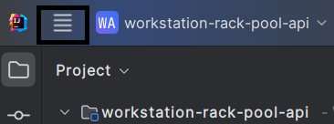
   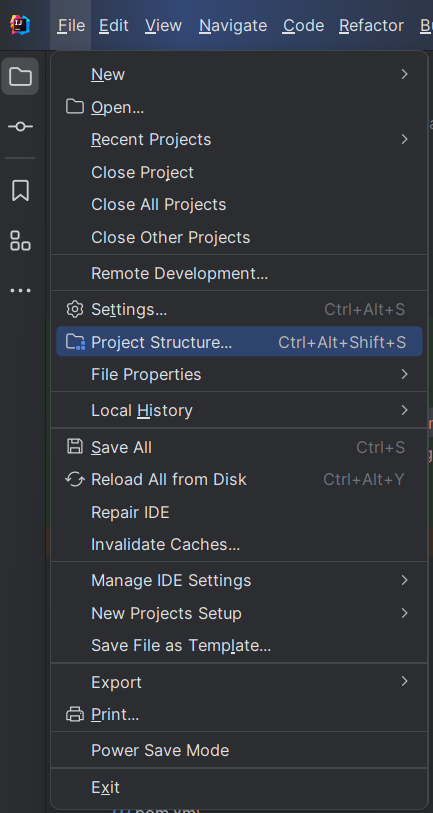
- Set the JDK as 21 (if you do not have this version yet, please download it) and set the language level to the same JDK version
   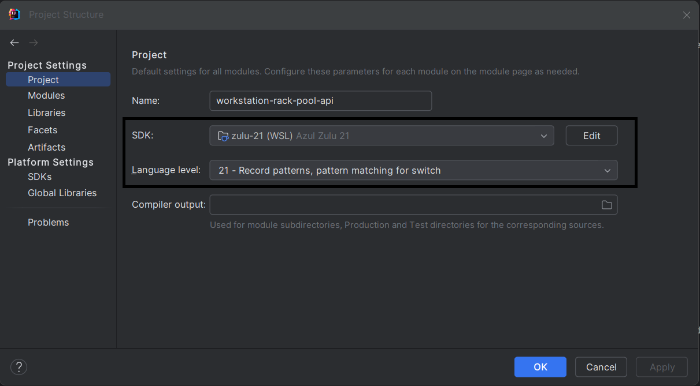

#### 2) Set IntelliJ to use the format specified in the ".editorconfig", line separator and project's encoding
- Click in the hamburger menu in the top left corner and go to "Settings...".
   
- Go to "Settings...".
   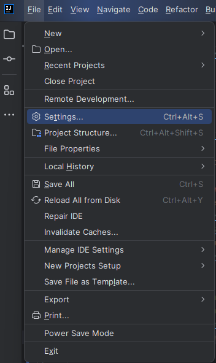
- Go to "Editor | Code Style" and set the "Scheme" as "Project" now in "Line Separator" selector set as "Unix and macOS (\n)", mark the two checkbox bellow the "Line Separator" selector, it they are unchecked.
   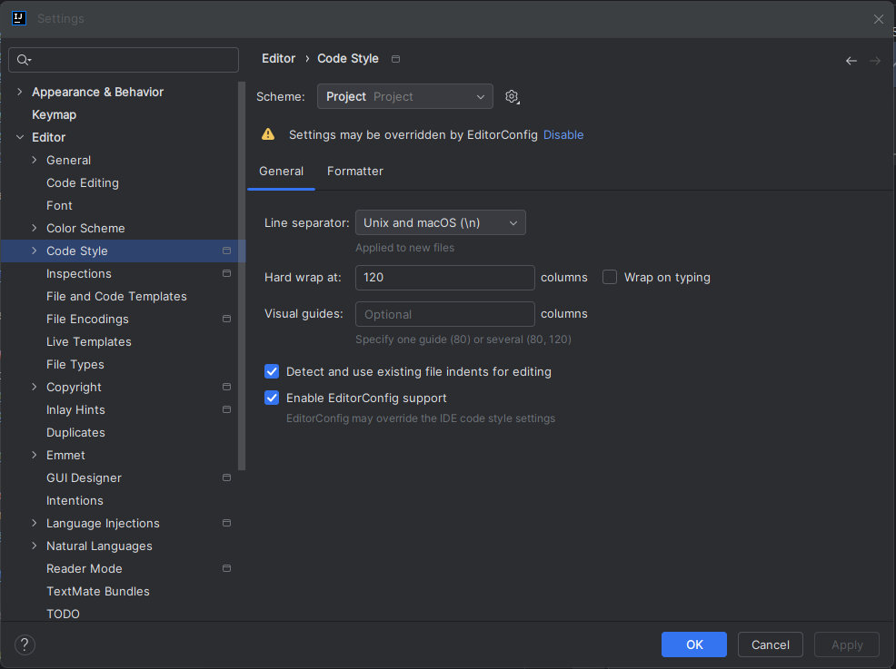
- Go to "Editor | File Encodings" and set the "Global Encoding" and the "Project Encoding" as "UTF-8" also set the "Default encoding for properties files" as "UTF-8".
   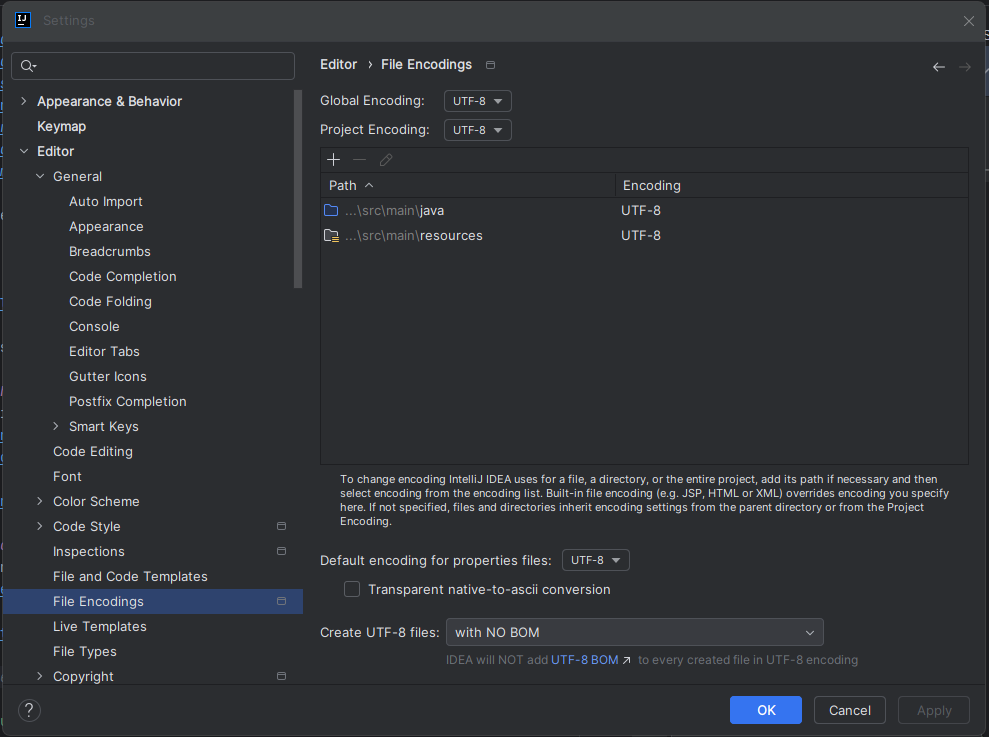

> **_TIP_**
>
> To help you to save space in your environment set your maven installation path in IntelliJ IDE
> - Click in the hamburger menu in the top left corner and go to "Settings...".
     
> - Go to "Settings...".
     
> - Go to "Build, Execution, Deployment | Build Tools | Maven" and set then Maven home path and uncheck "Use settings from .mvnw/maven.config" if it is checked.
     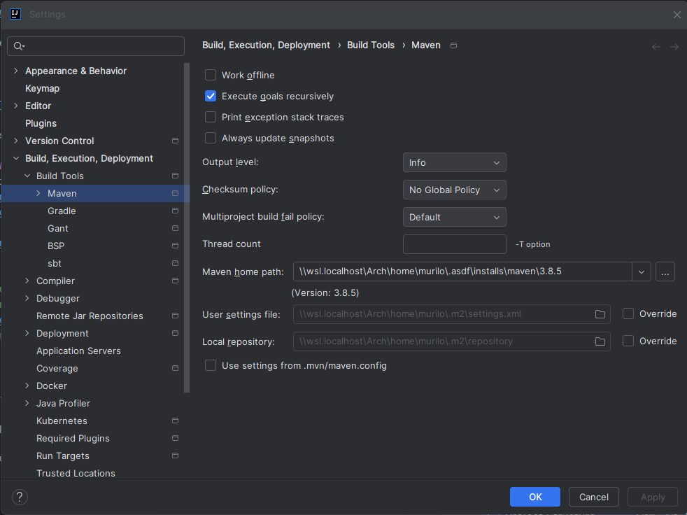

> **_NOTE_**
>
> After the changes mentioned above reimport maven project and rebuild the project.
> - Right click in the project root folder and first reimport maven project and next rebuild the module.
     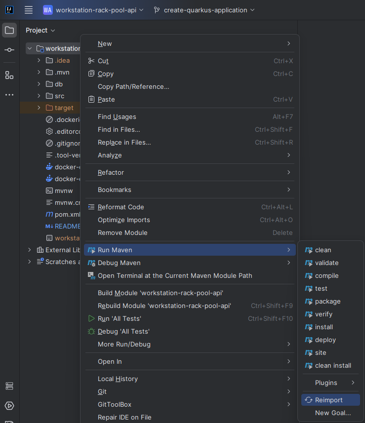
     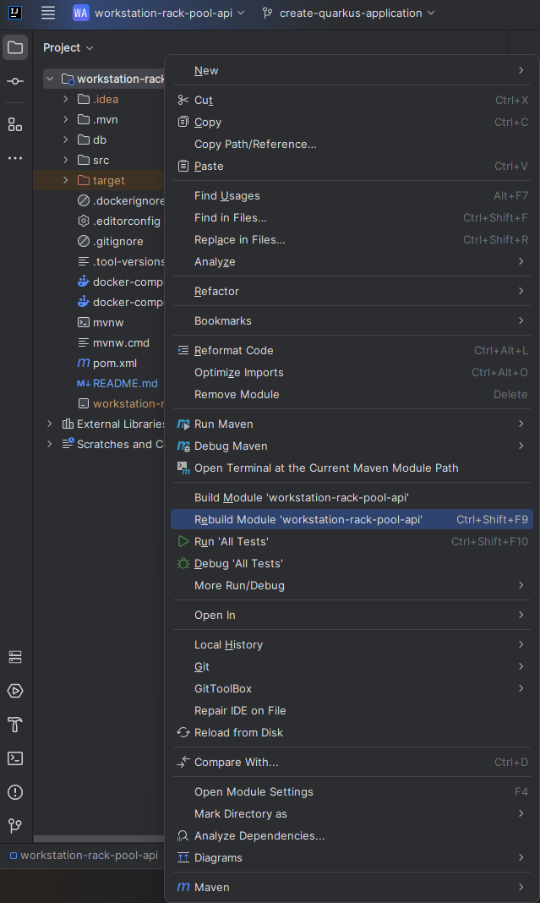

### Running the application's tests

> **_IMPORTANT_**
>
> Docker must be installed, it should be up and running in the environment before try to run the application.

There is no trick to run the tests in IntelliJ IDE the test can perform a single test or all tests together.

#### 1) All tests together
- Go to src/test/java and click up on it using the right button and choose run tests in Java.
   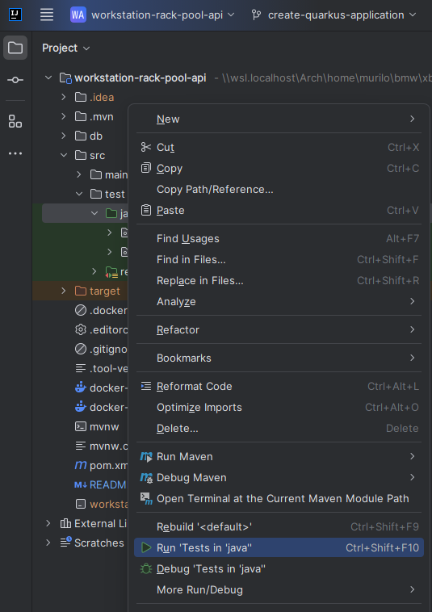

#### 2) Running single test
- Open a java test class, for instance, [BookingResourceIT.java](src/test/java/com/bmw/ctw/workstation/rack/api/booking/boundary/BookingResourceIT.java), then click up on the play button in the left corner right before the class or method declaration.
   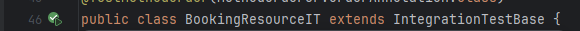
   or
   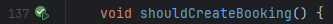

## Notes
<a id="note-1">[1]</a>
If you do not have a license for it ask your Titan one
